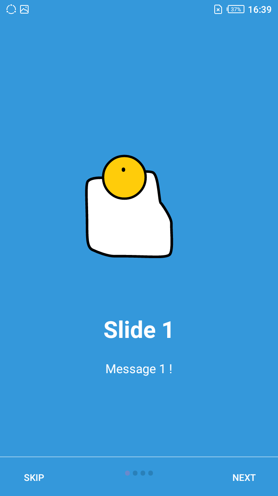
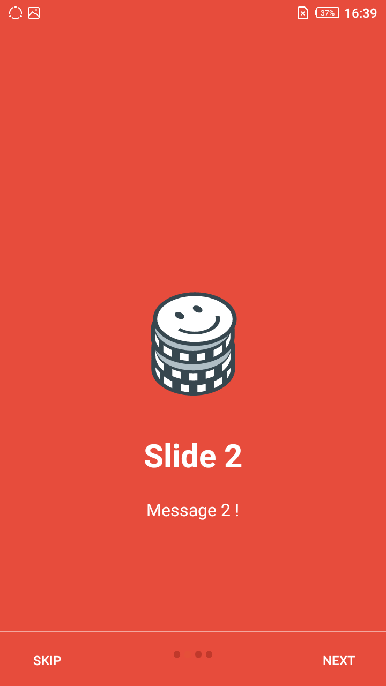
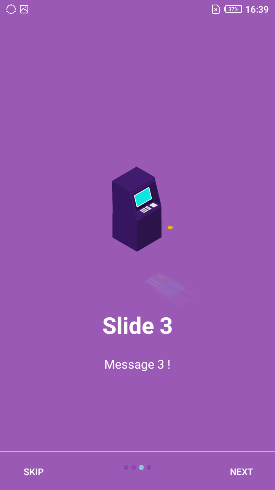
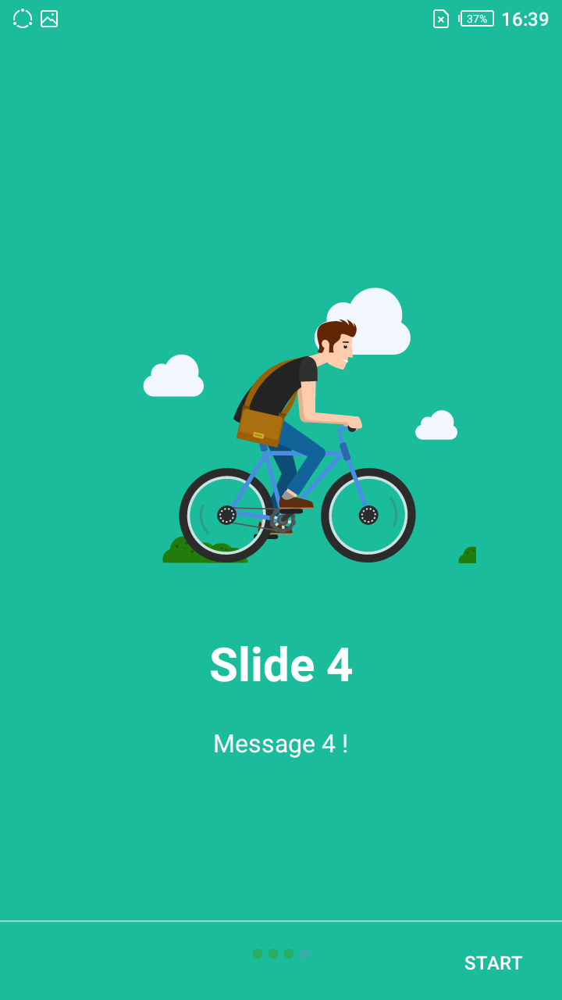
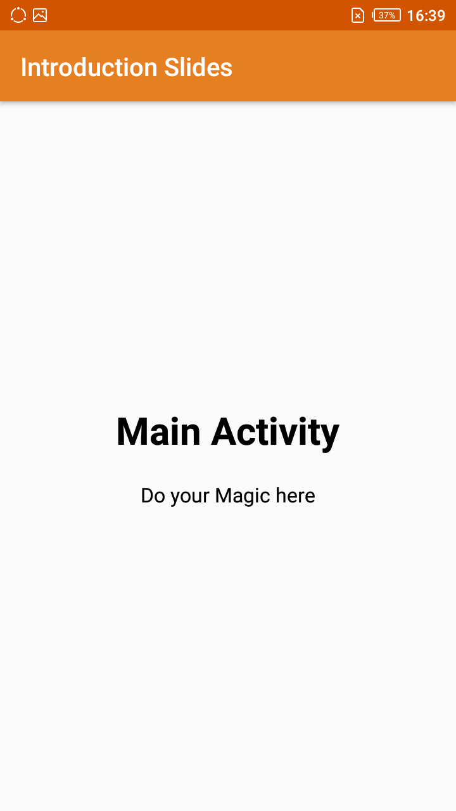

# Introduction Slides For Android Application.

Do you have an application and wish that you could add an introduction slider for new users to understand the app?
Then worry no more I got you covered with introduction slides with Gifs.

## Dependency

Gradle is the only supported build configuration, so just add the dependency to your project `build.gradle` file:

```groovy
dependencies {
  implementation 'com.airbnb.android:lottie:$lottieVersion'
}
```
The latest Lottie version is:


Lottie 2.8.0 and above only supports projects that have been migrated to [androidx](https://developer.android.com/jetpack/androidx/). For more information, read Google's [migration guide](https://developer.android.com/jetpack/androidx/migrate).

## App Preview

   
  


